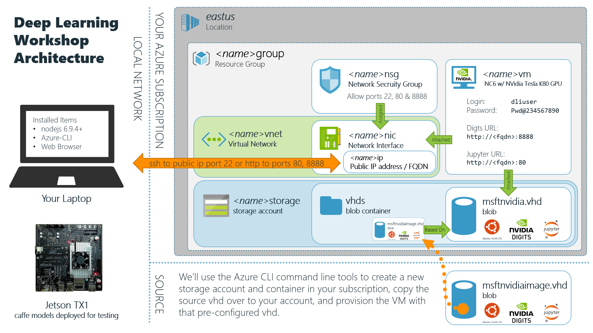
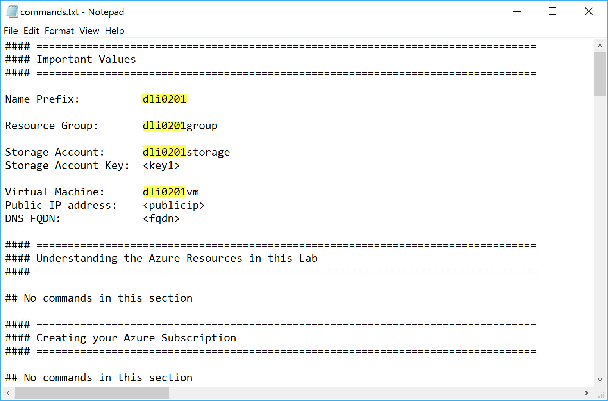
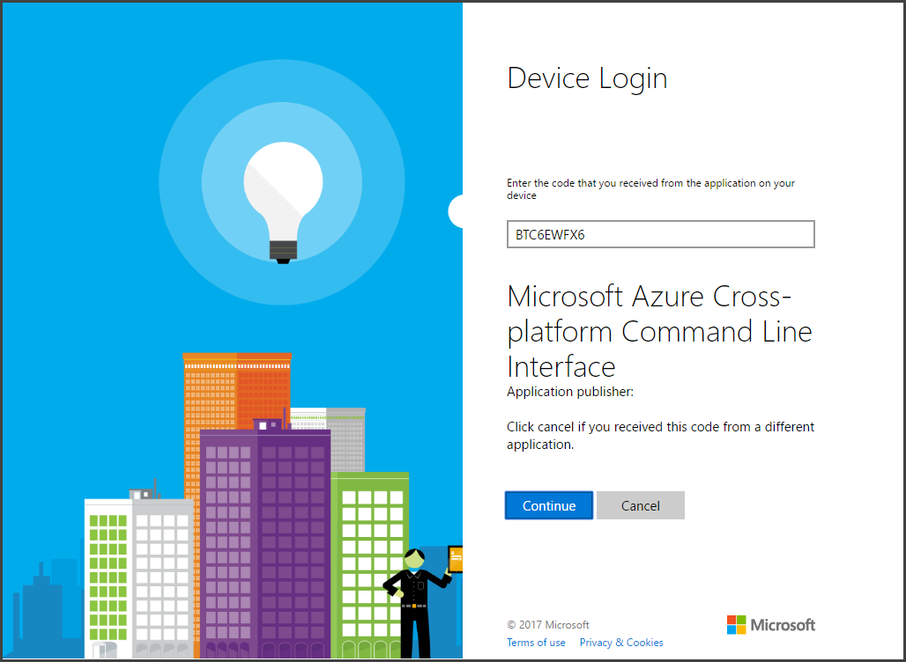
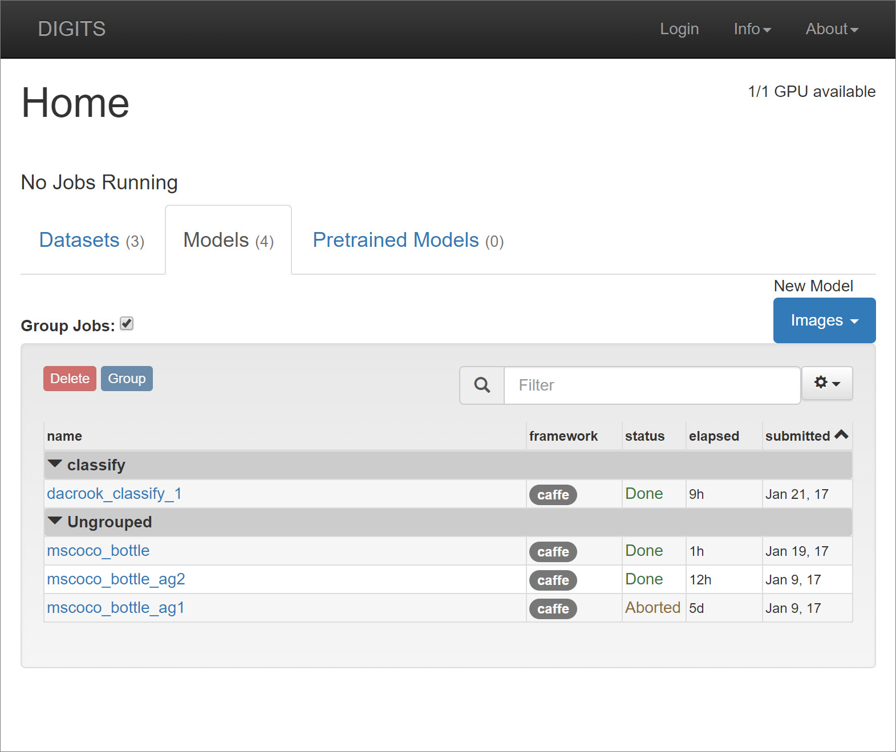
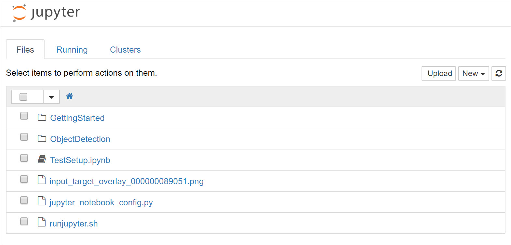
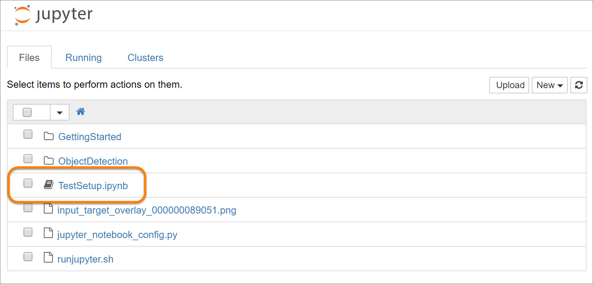
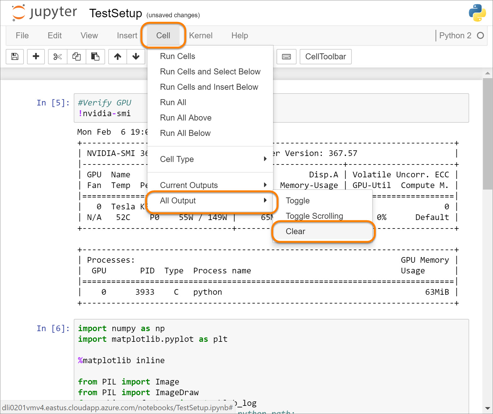
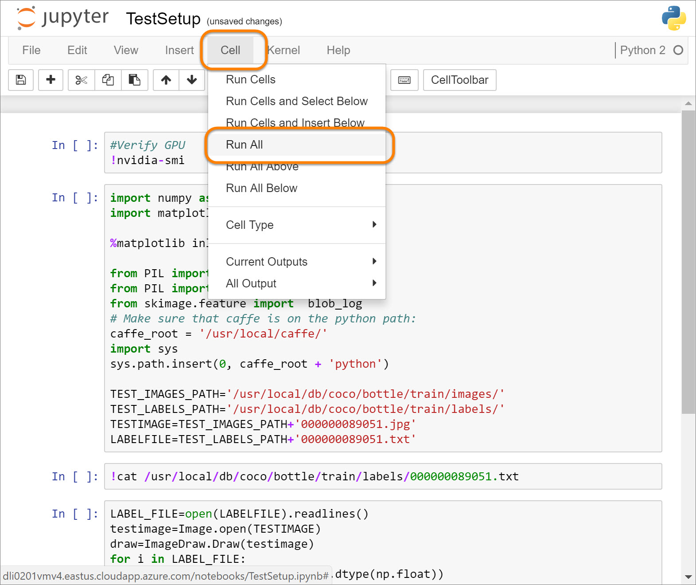
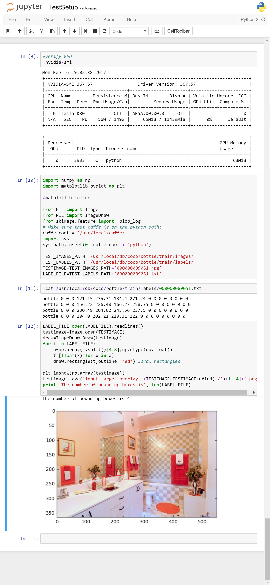
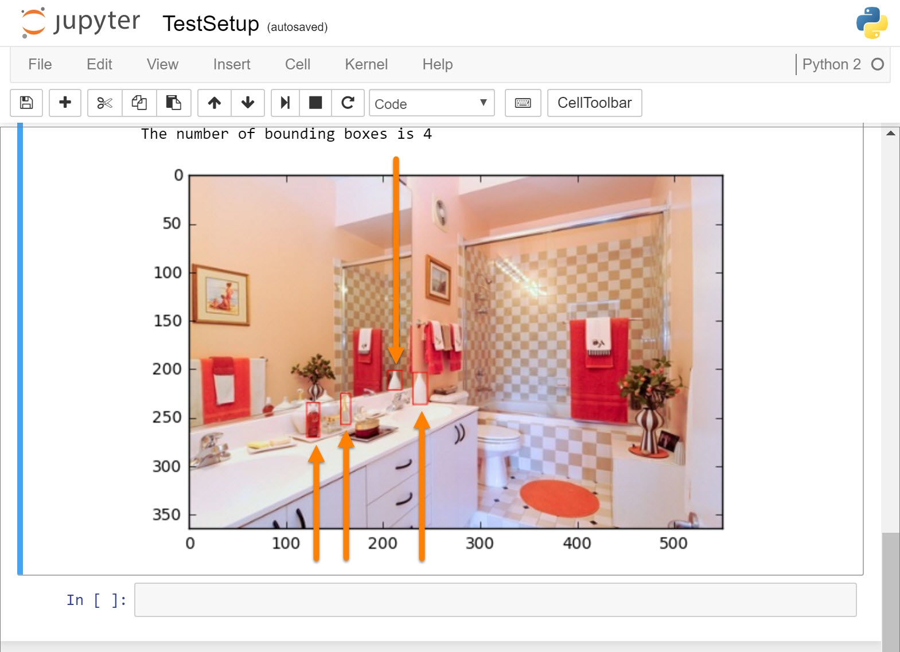

# Deep Learning Institute Robot Workshop Pre-Requiste Lab

In this lab, we'll walk workshop attendees through the required pre-requisite steps.  At the completion of this lab, attendees should have a properly prepared Virtual Machine running in Azure that has the NVidia GPUs, and lab assets needed for successful completion of the workshop.

---

<a name="prereqs"></a>

## Pre-Requisites

To complete this lab, you will need to have the following items:

1. A personal laptop running Windows, MAC OS X, or Linux.

1. An active azure subscription that you are willing to use for the lab.  **BE AWARE** the lab has you create N-Series VMs in Azure.  These VMs are special because they include NVidia GPU support and provide an extremely powerful environment for deep learning projects.  However, they are expensive when compared to other less capable VMs.  It is recommended that you use a trial subscription, or a subscription provided to you at a live event for the lab steps.  This will help to ensure that you are not billed for excessive VM utilization.

1. Nodejs v6.9.4 or later. You can download the current version of Nodejs from [https://nodejs.org/en/download/](https://nodejs.org/en/download/)

1. The Azure CLI installed. We will cover the installation below, but you can also follow the instructions from the [Install the Azure CLI](https://docs.microsoft.com/en-us/azure/xplat-cli-install) page.

1. Git installed.  If you don't have git on your system, you can install it from [https://git-scm.com/downloads](https://git-scm.com/downloads)

---

<a name="tasks"></a>

## Tasks

In this lab, you will complete the following tasks:

1. [Understanding the Azure Resources in this Lab](#task1)
1. [Cloning the GitHub repo to your computer](#task2)
1. [Creating your Azure Subscription](#task3)
1. [Installing the Azure Command-Line Interface (Azure CLI)](#task4)
1. [Logging into and configuring your Azure Subscription via the Azure CLI](#task5)
1. [Creating the Azure Resource Group, Storage Account, and Container](#task6)
1. [Copying the Virtual Hard Disk (VHD) for the Virtual Machine](#task7)
1. [Creating the Virtual Machine using the Copied VHD](#task8)
1. [Configuring Auto-shutdown on the new VM](#task9)
1. [Connecting to your Virtual Machine using SSH](#task10)

---

<a name="task1"></a>

## Understanding the Azure Resources in this Lab



In this workshop, you will be using an Azure Virtual Machine (VM) to complete your work. The Virtual Machine will use a copy of a pre-existing Virtual Hard Disk (VHD) that we have created for your use.  The pre-existing VHD has Ubuntu 16.0.4 LTS installed, along with all of the deep learning tools, frameworks, data sets and jupyter notebooks that you will need for the lab.  The purpose of this prework is to walk you step-by-step through the process of configuring your Azure Subscription with the resources necessary to complete the workshop.  This section is provided to help you better understand what those resources are in an effort to help you better understand the subsequent tasks, and the workshop overall.

### Azure Locations (Data Regions)

An Azure "Location", or "Region". Specifies the location of the Azure Data Center where you want your resources to be created.  The location that you use is very important in this lab because the N-Series Virtual Machines that have NVidia GPUs on them are only available in the "**East US**" or ("**eastus**") data center at this time.  This workshop requires the use of the NVidia GPUs on the N-Series VMs, so we will need to make sure to provision all of our resources in the "**eastus**" data center.  

> **Note**: The list of data centers where N-Series VMs are available will grow over time.  You can view the current data centers that support them on them "[Products available by region](https://azure.microsoft.com/en-us/regions/services/)" page.  If you choose to use a location other than "**eastus**", you will need to replace all occurrances of "**eastus**" in the instructions below with the name of the location you've chose.

### Azure Resource Groups

A typical solution in Azure requires multiple resources.  For example, in this workshop, we will create an Azure Storage Account to store a Virtual Hard Disk (vhd) file, and then we'll create a Virtual Machine based on that VHD.  In addition, we'll have Network Interfaces, Virtual Networks, Networks Security Groups and more.  To keep all of the resources organized, we'll place them all in a single "**Resource Group**".  Resource Groups offer a number of benefits in azure:

- You can create an Azure Resource Manager (ARM) template for all of the resources in your group to help automate the deployment of your resources.
- You can grant others access to your Resource Group without having to give them access to your entire subscription.
- When you no longer need the resources for a soulution, you can easily delete all of them at once by simply deleting the Resource Group that contains them.


### Azure Storage accounts

Azure Storage Accounts are a core Azure offering.  They support the storage of data in a variety of formats using a number of built-in services.  In this lab, we will be using Azure Storage Blob Containers to store the Virtual Hard Disk (VHD) blob for our Virtual Machine.  To accomplish this, we will need to first provision an Azure Storage account in our subscription, and ensure that it is in the "**eastus**" location.  Azure Storage Accounts are globally accessible and as such need a globally unique name.  We'll talk more about how these resources will be named later.

### Azure Virtual Machines

Azure Virtual Machines provide an extremely powerful and flexible way to run either Windows or Linux virtual machines in the cloud.  Virtual Machines use Virtual Hard Disks (vhd) files as their "disks".  In this workshop, we will be using a pre-provisioned Virtual Hard Disk that has the following pre-installed:

- Ubuntu 16.04 LTS
- DIGITS
- Jupyter

You will copy that vhd over to a storage account in your own subscription, and then use a template to create a Virtual Machine that uses that vhd as it's hard disk.

In addition to the vhd, your Virtual Machine will also need some additional resources.  These will all be created for you by a template, but it's helpful to understand them.

- A Network Interface (NIC) - This is the virtual version of the Network Interface (think ethernet port) on your computer.
- A public IP Address - This will be assigned to your NIC and is how we will access our VM over the Internet.
- A Fully Qualified Domain Name (FQDN): this will be your vm name, followed by `eastus.cloudapp.azure.com` (assuming you create your vm in the `eastus` data center).
- A Virtual Network - This is the internal virtual network that our NIC is attached to.  We don't really need it for this workshop, but a virtual network would allow you to connect multiple virtual machines to it, and allow direct, private communication between those VMs on that network.
- A Network Security Group - These provide the sets of firewall access rules that Azure enforces for you.  The template you run will create a network security group that allows incoming access to ports 22 (for ssh), 80 (for jupyter) and 8888 (for DIGITS).  The template then assigns that networks security group to your NIC.

### Choosing a good "***&lt;name&gt;***"

In the diagram above, you see a number of resources with names that match the pattern "***&lt;name&gt;xxx***".  A number of the resources you create will need a globally unique name, so following the pattern is recommended.

You will want to replace the "***&lt;name&gt;***" place holder (including the ***&lt;*** and ***&gt;*** angle brackets) with something unique to you.  Suggestions include:

- Use only simple lower case alphanumeric (a-z,0-9) characters.  No underscores, dashes, or special symbols.
- Your first, middle and last initials and the current Month and Day in ***mmdd*** format.  For example, if your name was John Q. Doe (***jqd***) , and the current date was February 1st (***0201***), you might use "***jqd0201***" in place of the "***&lt;name&gt;***" place holder.  If so, the Resource Group name would be "**jqd0201group**", the storage account name would be "**jqd0201storage**", and the virtual machine name would be "**jqd0201vm**".  You get the idea.
- Any other short set of characters that will likely result in a globally unique name, and that makes sense to you.

Choose a good ***&lt;name&gt;*** now, and make a note of it so you can use it later in the lab.

Throughout the remainder of the documentation the syntax samples will use ***dli0201*** ("dli" being short for Deep Learning Institute and "0201" for January, 31) as a ***&lt;name&gt;*** place holder value.  **DO NOT USE dli0201** for yourself, as it would likely conflict with the resources created while documenting this lab, or with others who lazily use that same name. 

---

<a name="task2"></a>

## Cloning the GitHub repo to your computer

You will need to modify the majority of the commands blow to use the ***&lt;name&gt;*** prefix you have chosen.  In addition, a number of the commands shown below are split across multiple lines for readability, but will need to be entered on a single line.  We have simplified this task for you by creating a "commands.txt" file in the github repo.  You can open that file, do some global search and replaces on for your specific values, then simply copy and past the commands from the file into your command prompt one by one.  

To do this, you will need to first clone the GitHub repo down to your personal workstation so you can get the file. 

1. From your system's command prompt or terminal, change to the folder where under which you want to clone the github repo (for example, your user's home directory):

    > **Note**: You can clone the repo on your workstation wherever you like, just make sure you know where it is!  We are just suggesting the home folder as a likely place.

    on Windows

    ```bash
    cd %HOMEPATH%
    ```

    in bash:

    ```bash
    cd ~
    ```

1. then use the git command line tool to clone the github repo:

    ```bash
    git clone http://github.com/dxcamps/DLI_RoboWorkshop_1
    ```

1. Once the github repo has been cloned, change into the `./DLI_RoboWorkshop_1/prework/deploy` folder

    ```bash
    cd ./DLI_RoboWorkshop_1/prework/deploy
    ```

1. You can list the contents of the folder with an `ls` (Mac or Linux) or `dir` (windows) command, and see the files in the folder:

    ```bash
    $ ls
    commands.txt  DeploymentHelper.cs  deploy.ps1  parameters.json
    deployer.rb   deploy-preview.sh    deploy.sh   template.json
    ```

1. Open the `commands.txt` file in the text editor of your choice.  You should see a number of place holders, like `<name>`, `<key1>`, `<publicip>` and `<fqdn>`.  We will be replacing each of those place holders with actual values as we work through the lab.  For now, the only one we know is the `<name>` prefix we chose in the last task.

1. In the text editor of your choice, do a global search and replace of the `<name>` place holder with the name prefix you chose above (our example, `dli0201`).

    - As and example, on Windows (use similar steps in your text editor if it is something other than notepad):

        - Open the commands.txt in Notepad, then from the edit menu, select "**Edit**" | "**Replace...**" from the menu bar, and in the "**Replace**" window, replace `<name>` with your prefix , for example `dli0201`.  Click the "**Replace All**" button, then close the "**Replace** window:

            

            You should notice that all the occurrances of `<name>` have been replaced with your prefix (again, for example `dli0201`):

            

        - ***Keep your text editor open so you can easily copy the commands from it.***

1. The commands.txt file has now been updated  with the `<name>` place holders replaced with your prefix name.  ***You can use those updated commands as you work through this lab, rather than copying them from this document, and modifying them one at a time.  Also, the commands have all been properly formatted on a single line and should work on both a Windows "Command Prompt" (not PowerShell though) as well as at a Bash prompt on Windows, Linux or Mac.***

---

<a name="task3"></a>

## Creating your Azure Subscription

If you are attending a sponsored workshop you should be receiving instructions prior to the event on how to sign up for you Azure subscription.  Follow the instructions in that email to create your subscription.

If you are running this prework before the workshop, make sure that it isn't so far in advance of the workshop that the pass may expire before the event date.  Also make sure to shutdown and deallocate (but not delete) the the virtual machine when you are done with the prework so that it doesn't consume the credits availalbe in your subscription.  We will show you how to both automatically (setup by default) as well as manually shutdown and deallocate your vm at the end of this lab.

If you do NOT have access to an Azure Pass, you can create a free Azure Trial subscription at [azure.com/free](http://azure.com/free).

> **Note**: The free Azure trial currently grants you a US$200 credit for a period of 30 days.  If either the 30 day limit, or $200 credit is exceeded, your trial resources (except those with free usage) will be shut down.  You will need a credit card to sign up for the trial, but it is used for identification purposes only and you will not be charged UNLESS you choose to go on a pay-as-you go basis.

Lastly, if you choose to use a personal subscription other than one created by an Azure Pass or Free Trial, be aware that you will be responsible for the usage incurred during this lab.  For more information on the costs associated with Azure resources, see the [Azure pricing](https://azure.microsoft.com/en-us/pricing/) page.

---

<a name="task4"></a>

## Installing the Azure Command-Line Interface (Azure CLI)

The Azure CLI is a cross platform command line interface that you can use to manage resources in your Azure Subscription from your local workstation.  The Azure CLI is a Nodejs application and as such runs on Windows, Linux and Mac OS X. It's for that reason specifically that we have chosen it as the toolset for this lab.

1. Ensure that you have Nodejs v6.9.4 or later installed.  If you don't you can install it from [https://nodejs.org/en/download/](https://nodejs.org/en/download/).

1. From your system's command prompt or terminal window, issue the following command:

    > **Note**: You can alternatively use an installer if you are on Windows or Mac OS X.  To find out more about using an installer, view [Option 2: Use an installer](https://docs.microsoft.com/en-us/azure/xplat-cli-install#option-2-use-an-installer) on the [Install the Azure CLI](https://docs.microsoft.com/en-us/azure/xplat-cli-install) page in the Azure documentation.

    ```bash
    npm i -g azure-cli
    ```
    On OS X and Linux systems, you may need to use `sudo` before the command.

    ```bash
    sudo npm i -g azure-cli
    ```
---

<a name="task5"></a>

## Logging into and configuring your Azure Subscription via the Azure CLI

In this steps, you'll login to your Azure subscription from your workstations command line.  There are multiple ways to login to the Azure-CLI.  You can learn about alternat login methods here: [Log in to Azure from the Azure CLI](https://docs.microsoft.com/en-us/azure/xplat-cli-connect) 

We'll be using the "**Azure login with interactive login**" method:

1. From your system's command prompt or terminal, enter the following command to set the azure-cli into "Azure Resource Manager" mode (ARM):

    > **Note**: The first time you use the azure-cli you will likely see a prompt that starts with "`Microsoft Azure CLI would like to collect data about how users use CLI
commands and some problems they encounter...`", asking you to participate in azure-cli data collection.  You can accept or decline as you wish, it won't impact how the cli functions. 

    ```bash
    azure config mode arm
    ```

1. Next, to login to your Azure Subscription from the azure-cli, issue:

    ```bash
    azure login
    ```

1. The output should be something similar to the following (output shown wrapped for readability):

    ```bash
    info:    Executing command login
    info:    To sign in, use a web browser to open the page https://aka.ms/devicelogin 
             and enter the code XXXXXXXXX to authenticate.
    ```
1. As instructed, copy the `XXXXXXXXX` code from the info message, open your browser, and navigate to the [http://aka.ms/devicelogin](http://aka.ms/devicelogin) site to authenticate:

    - Paste the `XXXXXXXXX` code copied from above into the box, then click "**Continue**":

        

    - Then authenticate with the credentials for your Azure Subscription

        

    - Back at the command prompt, you should get a login confirmation similar to the following:

        ```bash
        info:    Added subscription <Your Subscription Name>
        info:    Setting subscription "<Your Subscription Name>" as default
        info:    login command OK
        ```

1. If you only have a single azure subscription associated with the credentials you used above, then that subscription should be the current subscription.  However, if you have more than one subscription or if you want to just ensure the proper subscription is being used, follow these steps:

    - From the command prompt, or terminal window enter the following azure-cli command to get a list of the susbscriptions associated with your login:

        ```bash
        azure account list
        ```

    - You should get a result similar to the following:

        ```bash
        $ azure account list
        info:    Executing command account list
        data:    Name         Id                                    Current   State
        data:    ----------   ------------------------------------  --------  -------
        data:    Your Sub     wwwwwwww-wwww-wwww-wwww-wwwwwwwwwwww  true      Enabled
        data:    Azure Pass   zzzzzzzz-zzzz-zzzz-zzzz-zzzzzzzzzzzz  false     Enabled
        info:    account list command OK
        ```

    - If more than one subscription is listed above, you need to ensure that the subscription you wish to used is set as the "Current" subscription.  To do so, use the following azure-cli command:

        ```bash
        azure account set <Your Subscription Name or Subscription Id>
        ```

    - For example, if you are at a sponsored event and were given an Azure Pass to use, notice the subscription name of "`Azure Pass`" for the Azure Pass subscription.  We could then use this command to ensure that the "`Azure Pass`" subscription was the current subscription used by the azure-cli:

        > **Note**: If your subscription name has spaces in it, make sure to surround it in quotes.

        ```bash
        azure account set "Azure Pass"
        ```
    - Finally, to get the details of the current subscription, you can enter the following command:

        ```bash
        azure account show
        ```

    - The `azure account show` returns results similar to:

        ```bash
        info:    Executing command account show
        data:    Name                        : Azure Pass
        data:    ID                          : zzz...zzz
        data:    State                       : Enabled
        data:    Tenant ID                   : qqq...qqq
        data:    Is Default                  : true
        data:    Environment                 : AzureCloud
        data:    Has Certificate             : No
        data:    Has Access Token            : Yes
        data:    User name                   : dli2017001@outlook.com
        ```
---

1. We will be using a number of Azure "**Resource Providers**" in this lab.  Resource Providers enable us to manage specific types of resources in the Azure Platform via the "**Azure Resource Manager**" API that is used by the Azure-cli.  We need to enabled, or "**Register**" each of the providers we will be using before we can use them.  The "**Resource Providers**" we need include:

    - "Microsoft.Storage"
    - "Microsoft.Network"
    - "Microsoft.Compute"
    - "Microsoft.DevTestLab"

1. We'll use the Azure-cli to register each one.  Is the following command to register the "**Microsoft.Storage**" resource provider:

    ```bash
    azure provider register Microsoft.Storage
    ```

    Example output:

    ```bash
    info:    Executing command provider register
    + Registering provider Microsoft.Storage with subscription de9618cf-ca76-4a42-acf0-7f5f992a674a
    info:    provider register command OK
    ```

1. Repeat the `azure provider register` command for each of the other resource providers:

    ```bash
    azure provider register Microsoft.Network
    azure provider register Microsoft.Compute
    azure provider register Microsoft.DevTestLab
    ```

<a name="task6"></a>

## Creating the Azure Resource Group, Storage Account, and Container

The Azure Virtual Machine that you will be using for this lab will be based on a copy of a pre-existing Virtual Hard Disk (VHD) that we have created for your use.  The pre-existing VHD has Ubuntu 16.0.4 LTS installed, along with all of the deep learning tools, frameworks, data sets and jupyter notebooks that you will need for the lab.  In this task, you will create an Azure Resource Group, Storage Account, and Blob Container that will hold your copy of the VHD.

1. First, to create your Resource Group, from your system's command prompt or terminal window, issue the following command. Make sure to replace the ***&lt;name&gt;*** place holder in the `<name>group` name with the naming prefix you chose above.

    > **Note**: Recall that we need to create all of our resources in the same "Location" and that because the N-Series NVidia backed GPU Virtual Machines are currently only availalbe in the "**eastus**" region, we want to sepcify that as the location for our storage account.

    ```bash
    azure group create <name>group --location "eastus"
    ```

    The output should look something similar to:

    ```bash
    info:    Executing command group create
    + Getting resource group dli0201group
    + Creating resource group dli0201group
    info:    Created resource group dli0201group
    data:    Id:                  /subscriptions/zzz...zzz/resourceGroups/dli0201group
    data:    Name:                dli0201group
    data:    Location:            eastus
    data:    Provisioning State:  Succeeded
    data:    Tags: null
    data:
    info:    group create command OK
    ```

1. Next, create the Azure Storage Account within your new resource group, making sure again to use the appropriate location.  In the following command replace `<name>group` and `<name>storage` with the resource group and storage account names determined above:

    > **Note**: This command may take thirty seconds or longer to execute

    ```bash
    azure storage account create <name>storage --resource-group <name>group --location "eastus" --kind Storage --sku-name LRS
    ```
    sample output:

    ```bash
    info:    Executing command storage account create
    + Checking availability of the storage account name
    + Creating storage account
    info:    storage account create command OK
    ```

1. Now that you have a storage account, we need to retrieve the key needed to manage it:

    ```bash
    azure storage account keys list <name>storage --resource-group <name>group
    ```

    sample output:

    ```bash
    info:    Executing command storage account keys list
    + Getting storage account keys
    data:    Name  Key                                                                                       Permissions
    data:    ----  ----------------------------------------------------------------------------------------  -----------
    data:    key1  xxx...xxx==  Full
    data:    key2  yyy...yyy==  Full
    info:    storage account keys list command OK    
    ```


1. From the output, copy the value of the "key1" key (shown as `xxx......xxx==` above, and replace the `<key1>` place holders in commands.txt with it.


1. Next, we'll create the container to store the vhd for our virtual machine:

    > **Note**: This is a SINGLE command wrapped across multiple lines for readability. You need to copy, or type the syntax below as a single line, with the appropriate values for the `--account-name <name>storage`  and  `--account-key xxx...xxx==` values.

    ```bash
    azure storage container create
      --account-name <name>storage
      --account-key xxx...xxx==
      --container vhds
    ```

    The output should resemble the following:

    ```bash
    info:    Executing command storage container create
    + Creating storage container vhds
    + Getting storage container information
    data:    {
    data:        name: 'vhds',
    data:        metadata: {},
    data:        etag: '"0x8D44AE4B4FB4B44"',
    data:        lastModified: 'Wed, 01 Feb 2017 20:55:51 GMT',
    data:        lease: { status: 'unlocked', state: 'available' },
    data:        requestId: '41ae1c0e-0001-00bb-41cd-7c1bea000000',
    data:        publicAccessLevel: 'Off'
    data:    }
    info:    storage container create command OK
    ```

---

<a name="task7"></a>

## Copying the Virtual Hard Disk (VHD) for the Virtual Machine

Now that we have the Azure Resource Group, Storage Account and Blob Container created, we can now copy the pre-existing VHD provided for this workshop.  


1. To copy the pre-existing VHD from the hosted storage account into the container you just created, use the following command:

    > **Note**: The `--source-uri` value points to the location of the pre-created vhd.  It points to a vhd blob named `msftnvidia.vhd`.  The `--source-sas` is the Shared Access Signature (sas) that you need to use to get permissions to access the source vhd.  These are pre-existing values that need to be entered exactly as shown below.  Do not modify them. 

    ```bash
    azure storage blob copy start
        --dest-account-name <name>storage
        --dest-account-key <key1>
        --dest-container vhds
        --source-uri https://dlirwsourcestorage.blob.core.windows.net/vhds/msftnvidiaimage.vhd
        --source-sas "st=2017-01-02T00%3A36%3A00Z&se=2050-02-02T00%3A36%3A00Z&sp=rl&sv=2015-12-11&sr=b&sig=NidB6Dt4FsD5xNw1l931AIsayFUJrH%2B0vOKcKhsKoGA%3D"
    ```

1. The command should return output similar to the following:

    ```bash
    info:    Executing command storage blob copy start
    - Start copying blob https://dlirwsourcestorage.blob.core.windows.net/vhds/msftnvidiaimage.vhd
    data:    Copy ID                               Status
    data:    ------------------------------------  -------
    data:    89fa6be5-33f8-4602-b97d-06d255e6a0c6  pending
    info:    storage blob copy start command OK
    ```

1. The copy could take up to 30-60 minutes or possibly longer (in tests it sometimes ran as long as 60 minutes), you can monitor the progress by repeatedly issuing the following command:

    > **Note**: The `msftnvidia.vhd` blob name is the name of the pre-existing source vhd.  Do not change the name in the command below.

    ```bash
    azure storage blob copy show
      --account-name <name>storage
      --account-key <key1>
      --container vhds
      --blob msftnvidiaimage.vhd
    ```

    The output of the command above shows the copy status in the `Progress` and `Status` columns.  

    > **Note**: in the example shown below, the `Progress` value of `24528171008/107374182912` means that 24,528,171,008 bytes (22.8GB) of 107,374,182,912 (100GB) have been transferred, or in otherwords the copy is about 23% complete.  The `Status` column shows `pending` to indicate the copy is still in progress.

    ```bash
    info:    Executing command storage blob copy show
    + Getting storage blob information
    data:    Copy ID                               Progress                  Status
    data:    ------------------------------------  ------------------------  -------
    data:    89fa6be5-33f8-4602-b97d-06d255e6a0c6  24528171008/107374182912  pending
    info:    storage blob copy show command OK
    ```

1. Contiune to monitor the status of the copy by repeating the `azure storage blob copy show...` command above until the `Status` reads `success`:

    ```bash
    info:    Executing command storage blob copy show
    + Getting storage blob information
    data:    Copy ID                               Progress                   Status
    data:    ------------------------------------  -------------------------  ------
    data:    89fa6be5-33f8-4602-b97d-06d255e6a0c6  107374182912/107374182912  success
    info:    storage blob copy show command OK
    ```
---

<a name="task8"></a>

## Creating the Virtual Machine using the Copied VHD

We are almost ready, the final step is to deploy a new Virtual Machne (VM) to the resource group we created above that uses the VHD we just copied as it's OS Disk.  Turns out that VMs need a bunch of other things as well including Network Interfaces, Virtual Networks, IP Addresses, Firewall Rules, etc.  Rather than have you create each one of these by hand and risk doing something wrong, we will use a pre-configured Azure Resource Manager (ARM) template.  The template file is in the same github repo as the other workshop content so first, we'll need to clone the repo, then we can change into the folder with the deployment script and run the azure-cli command to deploy the vm based on the template. 

1. From your system's command prompt or terminal, ensure that you are `preworklab/deploy` directory under the location where you cloned the `DLI_RoboWorkshop_1` repository to:

    ```bash
    cd ./DLI_RoboWorkshop_1/prework/deploy
    ```

1. As before, can list the contents of the folder with an `ls` (Mac or Linux) or `dir` (windows) command, and see the files in the folder:

    ```bash
    $ ls
    commands.txt  DeploymentHelper.cs  deploy.ps1  parameters.json
    deployer.rb   deploy-preview.sh    deploy.sh   template.json
    ```

1. The last two files, `parameters.json` and `template.json` are the ones we'll use in this task:

    - `template.json` (**YOU DO NOT NEED TO MAKE ANY CHANGES IN THIS FILE**) contains the actual ARM template that defines all the resources that will be createad, e.g. The VM, Virtual Network, NIC, IP Address, Firewall Rules, etc.  
    - `parameters.json` contains the values that are needed for the deployment, like the actual name of the VM, the location where it should be deployed, etc.  You'll edit this file and enter the value for your `<name>` prefix.

1. Open the `parameters.json` file in the text editor of your choice.  Verify that the location is correct.  Change the "name_place_holder" parameter's value of `<name>` to the name prefix you chose above, and save your changes.

    Here's the original parameters.json file contents

    ```json
    {
        "$schema": "https://schema.management.azure.com/schemas/2015-01-01/deploymentParameters.json#",
        "contentVersion": "1.0.0.0",
        "parameters": {
            "location": {
                "value": "eastus"
            },
            "name_place_holder": {
                "value": "<name>"
            }
        }
    }
    ```

    and with our sample ***dli0201*** value for ***&lt;name&gt;***:

    ```json
    {
        "$schema": "https://schema.management.azure.com/schemas/2015-01-01/deploymentParameters.json#",
        "contentVersion": "1.0.0.0",
        "parameters": {
            "location": {
                "value": "eastus"
            },
            "name_place_holder": {
                "value": "dli0201"
            }
        }
    }
    ```


1. Use the Azure CLI to deploy the vm using the template:

    ```bash
    azure group deployment create
      --resource-group <name>group
      --name vmdeployment
      --template-file template.json
      --parameters-file parameters.json
    ```

    Once it completes, you should see output similar to the following:

    ```bash
    info:    Resource 'shutdown-computevm-dli0201vm' of type 'Microsoft.DevTestLab/schedules' provisioning status is Succeeded
    info:    Resource 'dli0201vm' of type 'Microsoft.Compute/virtualMachines' provisioning status is Succeeded
    info:    Resource 'dli0201nic' of type 'Microsoft.Network/networkInterfaces' provisioning status is Succeeded
    info:    Resource 'dli0201storage' of type 'Microsoft.Storage/storageAccounts' provisioning status is Succeeded
    info:    Resource 'dli0201ip' of type 'Microsoft.Network/publicIPAddresses' provisioning status is Succeeded
    info:    Resource 'dli0201vnet' of type 'Microsoft.Network/virtualNetworks' provisioning status is Succeeded
    info:    Resource 'dli0201nsg' of type 'Microsoft.Network/networkSecurityGroups' provisioning status is Succeeded
    data:    DeploymentName     : vmdeployment
    data:    ResourceGroupName  : dli0201group
    data:    ProvisioningState  : Succeeded
    data:    Timestamp          : 2017-02-02T00:09:48.480Z
    data:    Mode               : Incremental
    data:    CorrelationId      : 6be18319-1546-409b-8f2f-732923ad7571
    data:    DeploymentParameters :
    data:    Name         Type    Value
    data:    -----------  ------  -------
    data:    location     String  eastus
    data:    name_prefix  String  dli0201
    info:    group deployment create command OK
    ```

1. Finally, to connect to the vm, you will need to know it's fully qualified domin name (fqdn) and/or ip address.  You can get all the details about your vm using:

    ```bash
    azure vm show --resource-group <name>group --name <name>vm
    ```

    sample output:

    ```bash
    info:    Executing command vm show
    + Looking up the VM "dli0201vm"
    + Looking up the NIC "dli0201nic"
    + Looking up the public ip "dli0201ip"
    data:    Id                              :/subscriptions/xxx...xxx/resourceGroups/dli0201group/providers/Microsoft.Compute/virtualMachines/dli0201vm
    data:    ProvisioningState               :Succeeded
    data:    Name                            :dli0201vm
    data:    Location                        :eastus
    data:    Type                            :Microsoft.Compute/virtualMachines
    data:
    data:    Hardware Profile:
    data:      Size                          :Standard_NC6
    data:
    data:    Storage Profile:
    data:
    data:      OS Disk:
    data:        OSType                      :Linux
    data:        Name                        :dli0201vm
    data:        Caching                     :ReadWrite
    data:        CreateOption                :Attach
    data:        Vhd:
    data:          Uri                       :https://dli0201storage.blob.core.windows.net/vhds/msftnvidia.vhd
    data:
    data:    Network Profile:
    data:      Network Interfaces:
    data:        Network Interface #1:
    data:          Primary                   :true
    data:          MAC Address               :00-0D-3A-12-95-E7
    data:          Provisioning State        :Succeeded
    data:          Name                      :dli0201nic
    data:          Location                  :eastus
    data:            Public IP address       :40.114.1.63
    data:            FQDN                    :dli0201vm.eastus.cloudapp.azure.com
    data:
    data:    Diagnostics Instance View:
    info:    vm show command OK
    ```

1. From the output, copy the "FQDN" (`dli0201vm.eastus.cloudapp.azure.com` above) value and replace the `<fqdn>` place holders in commands.txt.  Additionally, copy the "Public IP address" (`40.114.1.63` above) and replace the `<publicip>` placholders in the commands.txt.

---

<a name="task9"></a>

## Configuring Auto-shutdown on the new VM

FYI, the VM Template we deployed has Auto-Shutdown enabled by default.  Unless you change it, your VM will shutdown automatically at 11:59pm Pacific Standard Time every night.  If you want to change that setting, or disable it, you can complete these steps.

1. Open the [Azure Portal](https://portal.azure.com) and login with the credentials for your Azure Subscription
1. Click on the "Resource Groups" icon along the left of the portal, then select the `dlixxxgroup` Resource Group you created above.  
1. From the list of resources in the Resource Group, click on your Virtual Machine to open it's overview blade. 
1. From the list of settings along the left, click on "**Auto-shutdown**".  
1. Then in the "**Auto-shutdown**" blade, configure the option according to your desires.  You can read more about the feature here, [Announcing auto-shutdown for VMs using Azure Resource Manager](https://azure.microsoft.com/en-us/blog/announcing-auto-shutdown-for-vms-using-azure-resource-manager/)

---

<a name="task10"></a>

## Connecting to your Virtual Machine using SSH and starting Digits

1. The user name and password for the vm are:

    - user: `dliuser`
    - paasword: `Pwd@234567890`

1. Use the ssh client of your choice, and ssh into either the fqdn or ip address for your vm, and use the user name and password given above to login:

    ```bash
    ssh dliuser@<fqdn>
    ```

    or

    ```bash
    ssh dliuser@<publicip>
    ```

1. Once logged in, you should be in the `dliuser`'s `home` folder.  Next, clone the github repo for the workshop into the vm so you have a copy of all the code needed:

    ```bash
    git clone https://github.com/dxcamps/DLI_RoboWorkshop_1
    ```

    The repo should be cloned into:

    ```bash
    ~/DLI_RoboWorkshop_1
    ```

    or 

    ```bash
    /home/dliuser/DLI_RoboWorkshop_1
    ```

1.  Change into the `/usr/local/digits` folder

    ```bash
    cd /usr/local/digits
    ```

1. Run the `digits-devserver` server on port `8888`:

    > **Note**: the `&` at the end of the command allows starts the digits server in the background so you can cancel out of the command to return to the prompt if needed.

    ```bash
    ./digits-devserver --port 8888 &
    ```

1. Wait until the output shows something similar to:

    > **Note**: This could take up to two minutes or longer the first time you run it on your server.  Don't try to connect from your local browser until tyou see the `[INFO] Loaded x jobs.` message.

    ```bash
    [1] 3932
    ___ ___ ___ ___ _____ ___
    |   \_ _/ __|_ _|_   _/ __|
    | |) | | (_ || |  | | \__ \
    |___/___\___|___| |_| |___/ 5.0.0-rc.1

    Couldn't import dot_parser, loading of dot files will not be possible.
    2017-02-06 18:40:10 [INFO ] Loaded 7 jobs.
    ```

1. From your personal workstation, open a browser window and navigate to `http://<fqdn>:8888` where `<fqdn>` is the fully qualified domain name for your vm that you copied earier.  

    ```bash
    http://<fqdn>:8888
    ```

    You should see a page similaro to the following load in your browser:

    


---

<a name="task11"></a>

## Staring and Testing Jupyter

1. ***OPEN A SECOND SSH CONNECTION*** (keep the ssh session with DIGITS running in it open) to your vm (logging in again as `dliuser` with the password `Pwd@234567890`), and again change into the `~/DLI_RoboWorkshop_1/notebooks` folder.

    ```bash
    cd ~/DLI_RoboWorkshop_1/notebooks
    ```

1. Run the jupyter server on port 80 (***don't forget the `sudo`***):

    ```bash
    sudo jupyter notebook --port 8 &
    ```

1. Wait for output similar to:

    ```bash
    [1] 4043
    [I 18:42:41.404 NotebookApp] Writing notebook server cookie secret to /home/dliuser/.local/share/jupyter/runtime/notebook_cookie_secret
    [W 18:42:41.615 NotebookApp] WARNING: The notebook server is listening on all IP addresses and not using encryption. This is not recommended.
    [W 18:42:41.615 NotebookApp] WARNING: The notebook server is listening on all IP addresses and not using authentication. This is highly insecure and not recommended.
    [I 18:42:41.662 NotebookApp] Serving notebooks from local directory: /home/dliuser/DLI_RoboWorkshop_1/notebooks
    [I 18:42:41.662 NotebookApp] 0 active kernels
    [I 18:42:41.662 NotebookApp] The Jupyter Notebook is running at: http://[all ip addresses on your system]:80/
    [I 18:42:41.662 NotebookApp] Use Control-C to stop this server and shut down all kernels (twice to skip confirmation).
    ```

1. Back, on your personal laptop, open a browser and navigate to `http://<fqdn>:80` where `<fqdn>` is the fully qualified domain name of your vm that you copied earlier:

    ```bash
    http://<fqdn>:80
    ```

    You should see a page similar to the following:

    

1. Click on the "**TestSetup.ipynb**" link to open the test notebook.

    

1. From the Jupyter menu bar, select "**Cell**" | "**All Output**" | "**Clear**":

    

1. Once the output is cleared, you can run all the cells by selecting "**Cell**" | "**Run All**" from the menu bar:

    

1. You should see output similar to the following:

    

1. The top section verifies that the NVidia GPU is present, and reports details on it:

    

1. The rest of the Test page, loads a picture with some bottles in it, as well as the output of the training data that was generated for the image, then plots boxes around the bottles that the training process found in the image: 

    > **Note**: Notice the red boxes drawn around the three bottles found on the bathroom counter top.  It even outlined the partial reflection in of one of the bottles in the mirror:

    


