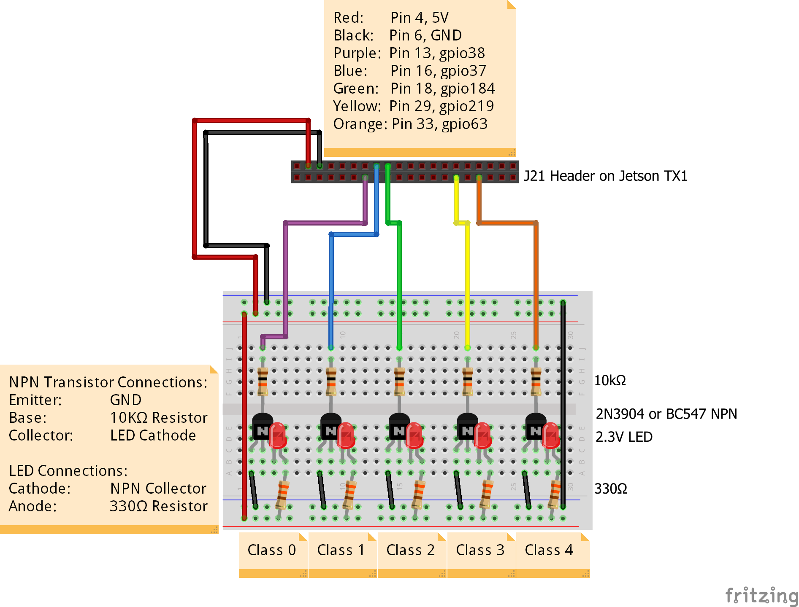
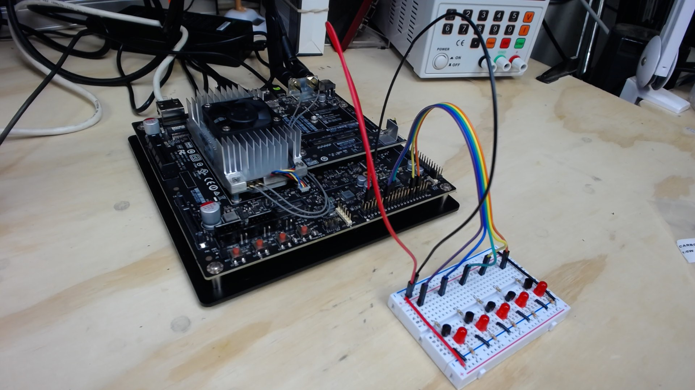
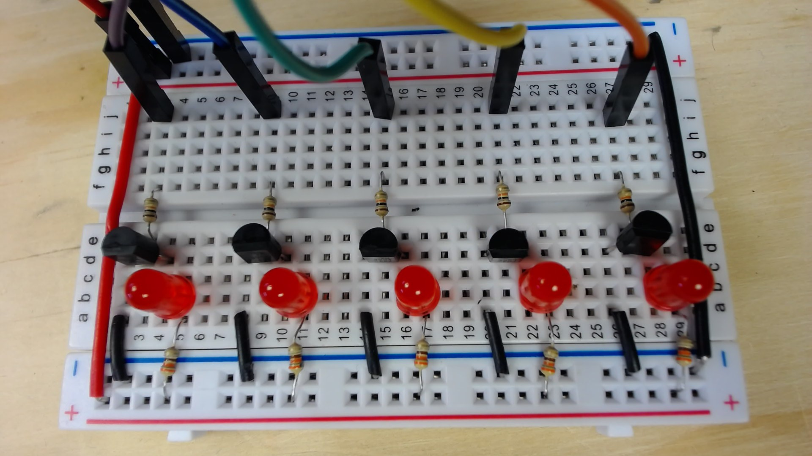
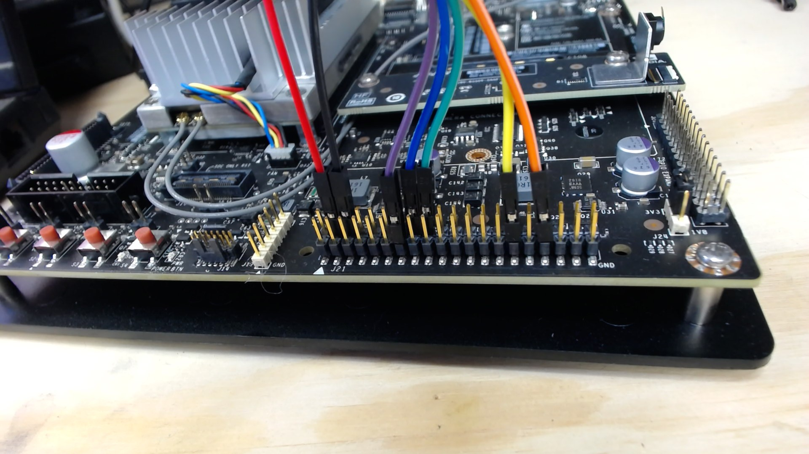
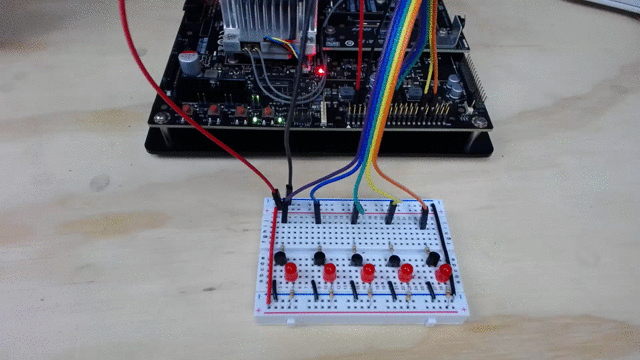

# Jetson TX1 Preparation

These are the steps to prepare the Jetson TX1 for the workshop.

1. [Applying the JetPack for L4T 2.3.1](#task1)
1. [Installing a Web Browser on the TX1](#task2)
1. [Downloading the Code and deploy_files](#task3)
1. [Installing Dependencies](#task4)
1. [OPTIONAL - Compiling caffe fp16 and fp32](#task5)
1. [OPTIONAL - Downloading the AlexNet and GoogLeNet caffe models](#task6)
1. [Testing caffe](#task7)
1. [Building the LED circuit](#task8)
1. [Testing the models with the LEDs](#task9)

___

<a name="task1"></a>

## Applying JetPack for L4T 2.3.1

To update your Jetson TX1 to the appropriate Ubuntu version, you need to apply JetPack for L4T 2.3.1.  This will ensure that the TX1 is running correct version of Ubuntu, and that the latest libraries, frameworks and tools have been installed.

The following steps are performed on the TX1 by the JetPack install:
 - Flash 64 Bit OS to TX1 device
 - Push and install 64Bit CUDA on target
 - Push and install GIE on target
 - Push and install 64Bit OpenCV4Tegra on target
 - Push and install 64Bit PerfKit on target
 - Push and install 64Bit cuDNN on target
 - Push and install 64Bit VisionWorks on target
 - Push and install 64Bit VisionWorks SFM on target
 - Push and install 64Bit VisionWorks Tracking on target
 - Cross-compile 64Bit CUDA samples and push to target
 - Push and install MMAPI on target

You can learn more about the JetPack [here](http://docs.nvidia.com/jetpack-l4t/index.html#developertools/mobile/jetpack/l4t/2.3/jetpack_l4t_main.htm)

***JetPack for L4T installation requires an Ubuntu 14 or later host machine as well as the Jetson TX1.  If you are on Windows you may consider using an Ubuntu boot USB, or creating a VMWare Player or VirtualBox virtual machine with Ubuntu installed.  You cannot easily use Hyper-V because part of the installation requires connecting to the TX1 via USB from the Ubuntu host, and Hyper-V does not support USB access from non-windows guests.***

1. Install the JetPack for L4T 2.3.1 by following the instructions in the [Installation Guide](http://docs.nvidia.com/jetpack-l4t/index.html#developertools/mobile/jetpack/l4t/2.3/jetpack_l4t_install.htm) .  _Make sure to include the all of the steps under "**For Jetson TX1 64Bit**"_

1. Once the JetPack installation is complete, you can login to the Jetson TX1 with the following credentials:

    - Login:    `ubuntu`
    - Password: `ubuntu`

___

<a name="task2"></a>

## Installing a Web Browser on the TX1

There are a few steps in this walkthrough that may require access to the web.  We'll start by making sure a web browser is available. 

1. From a terminal window on the TX1 (you can press Ctrl-Alt-T on the TX1 keyboard to open a terminal prompt) run the following commands:

    ```bash
    sudo apt-get update
    ``` 

    and

    ```bash
    sudo apt-get install chromium-browser
    ```
1. Once the install command is complete, you can open the chromium browser by first opening the Ubuntu Dashboard, or "Dash". The dashboard is identified by the Ubunto Icon on the top left corner of the desktop, or you can open it by pressin the `Super` key.  The `Super` key is the `Windows Key` on windows keyboards, or the `Command` key on Macs.

1. Once the dashboard, or "dash" is open, you can type "chromium" to find the browser icon.  While it is visible, you can drag the icon for the chromium browser to the launcher bar on the left of the screen so you can easily access it in the future. 

___

<a name="task3"></a>

## Downloading the Code and deploy_files

There are two source code files provided by for the workshop.  

- `Code.zip` contains two versions of caffe from the http://github.com/nvidia/caffe repo.
    - `/Code/fp32/caffe` is a clone of the default [caffe-0.15](https://github.com/nvidia/caffe) branch
    - `/Code/fp16/caffe` contains a clone of the [experimental/fp16](https://github.com/nvidia/caffe/tree/experimental/fp16) branch
    - Both of the clones have been modified for this workshop.  Make sure to use the files from the `Code.zip` file rather than creating new clones of the repos.
- `deploy_files.zip` contains:
    - Sample scripts, protobuf files, image files, etc.
    - The AlexNet and GoogLeNet caffemodel files

1. From the Terminal Window on the TX1 (Ctrl-Alt-T), make sure you are in the `/home/ubuntu` directory.

    ```bash
    cd /home/ubuntu
    ```

1. Run the following statement to download the Code.zip file:

    > **Note**: This is a 320MB file and will take 3 to 4 minutes or longer to download. This file is big because it includes the compiled version of both the fp16/caffe and fp32/caffe source folders.

    ```bash
    wget --no-check-certificate -O Code.zip http://aka.ms/codezip
    ```
1. Still in the `/home/ubuntu` directory, undzip the `Code.zip` file with:

    ```bash
    unzip Code.zip
    ```
1. Next, from the `/home/ubuntu` directory, get `deploy_files.zip`

    > **Note**: This is a 282MB file, and will take 2 to 3 minutes or longer to download.  Why so large?  This file includes the AlexNet and GoogLeNet caffemodel files which total about 300MB unzipped together.

    ```bash
    wget --no-check-certificate -O deploy_files.zip http://aka.ms/deployfileszip
    ```
1. Once it is downloaded, unzip it:

    ```bash
    unzip deploy_files.zip
    ```

1. From the [Google Drive](https://drive.google.com/drive/u/1/folders/0B-wiicg2Oj7nZWtUMzZrZXFGdjg), download the `Code.zip` and `deploy_files.zip` files
     - We need a more publicly accessible path for these
1. Extract `Code.zip` to `/home/ubuntu/Code` (note the upper case "`C`" in the destination folder name of "`Code`")
1. Extract `deploy_files.zip` to `/home/ubuntu/deploy_files`

___

<a name="task4"></a>

## Installing Dependencies

1. From a terminal prompt on the TX1 (Ctrl-Alt-T), run the following command to install the caffe pre-requisites:

    > **Note**: Make sure to press `y` to allow the installs to occur.

    ```bash
    sudo apt-get install \
      cmake \
      git \
      libboost-all-dev \
      libgflags-dev \
      libgoogle-glog-dev \
      protobuf-compiler \
      libprotobuf-dev \
      libboost-thread1.58-dev \
      libatlas-dev \
      libatlas-base-dev \
      libatlas3-base \
      libhdf5-dev \
      libleveldb-dev \
      liblmdb-dev
    ```

1. Next, make the appropriate symlinks for key libraries:

    ```bash
    cd /usr/lib/aarch64-linux-gnu
    sudo ln -s libhdf5_serial.so.*.*.* libhdf5.so
    sudo ln -s libhdf5_serial_hl.so.*.*.* libhdf5_hl.so
    sudo ln -s libsnappy.so.*.*.* libsnappy.so
    sudo ldconfig
    ```

1. You can verify the symlinks you just created, by running the following commands, and verify that the symlinks are pointing to a specific version of their corresponding libraries:

    ```bash
    readlink -f /usr/lib/aarch64-linux-gnu/libhdf5.so
    readlink -f /usr/lib/aarch64-linux-gnu/libhdf5_hl.so
    readlink -f /usr/lib/aarch64-linux-gnu/libsnappy.so
    ```

    Example executions and outputs (your versions may be different as time goes on):

    ```bash
    ~$ readlink -f /usr/lib/aarch64-linux-gnu/libhdf5.so
    /usr/lib/aarch64-linux-gnu/libhdf5_serial.so.10.1.0

    ~$ readlink -f /usr/lib/aarch64-linux-gnu/libhdf5_hl.so
    /usr/lib/aarch64-linux-gnu/libhdf5_serial_hl.so.10.0.2

    ~$ readlink -f /usr/lib/aarch64-linux-gnu/libsnappy.so
    /usr/lib/aarch64-linux-gnu/libsnappy.so.1.3.0
    ```

1. You can set the clocks on the Jetson TX1 to max speed to help decrease compiliation and execution times by running the following command:

    > **Note**: After you run the script, you should notice that the CPU fan on the TX1 is turned on if it wasn't already running. 

    ```bash
    sudo ~/jetson_clocks.sh
    ```
___

<a name="task5"></a>

## OPTIONAL - Compiling caffe fp16 and fp32

The Code.zip file you downloaded previously should have compiled versions of both the fp16/caffe and fp32/caffe sources.  However, if there are issues with the builds, you can recompile them using these steps.

1. OPTIONAL - Compile caffe fp16.

    > **Note**: This could take 10 minutes or longer to complete.  You will also likey see a number of `nvcc warning:` messages.  These can be safely ignored.

    ```bash
    cd /home/ubuntu/Code/fp16/caffe
    make clean
    make -j4 all
    ```

1. OPTIONAL - Compile caffe fp32.

    > **Note**: This could take 12 minutes or longer to complete.  You will also likey see a number of `nvcc warning:` messages.  These can be safely ignored.

    ```bash
    cd /home/ubuntu/Code/fp32/caffe
    make clean
    make -j4 all
    ```
___

<a name="task6"></a>

## OPTIONAL - Downloading the GoogLeNet and AlexNet caffe models

The `deploy_files.zip` file you downloaded previously should already have included these files.  If you have issues with them, you can re-download them using these steps.

1. On the TX1, in a Terminal Window (Ctrl-Alt-T), change into the `deploy_files` folder:

    ```bash
    cd /home/ubuntu/deploy_files
    ```

1. OPTIONAL - Download the GoogLeNet caffe model

    > **Note**: This is a 51MB file and will take a minute or two or longer to download depending on the speed of your network.

    ```bash
    wget http://dl.caffe.berkeleyvision.org/bvlc_googlenet.caffemodel
    ```

1. OPTIONAL - Download the AlexNet caffe model

    > **Note**: This is a 233MB file and will five to six minutes or longer to download depending on the speed of your network.

    ```bash
    wget http://dl.caffe.berkeleyvision.org/bvlc_alexnet.caffemodel
    ```
___

<a name="task7"></a>

## Testing caffe

1. On the TX1, in a Terminal Window (Ctrl-Alt-T),  test the fp16 caffe build by running the following commands:

    - First test to see if it can identify a banana from a static banana.jpg image:

        ```bash
        ~/Code/fp16/caffe/build/examples/cpp_classification/classification.bin \
          /home/ubuntu/deploy_files/deploy.prototxt \
          /home/ubuntu/deploy_files/bvlc_alexnet.caffemodel \
          /home/ubuntu/deploy_files/imagenet_mean.binaryproto \
          /home/ubuntu/deploy_files/synset_words.txt \
          /home/ubuntu/deploy_files/banana.jpg
        ```

        Sample output (notice that banana was the top guess, with a .9996 confidence level):

        ```bash
        ---------- Prediction for /home/ubuntu/deploy_files/banana.jpg ----------
        0.9996 - "n07753592 banana"
        0.0002 - "n03786901 mortar"
        0.0000 - "n07749582 lemon"
        0.0000 - "n03775546 mixing bowl"
        0.0000 - "n01945685 slug"
        ```

    - Next, test a lemonfrom the static lemon.jpg image:

        ```bash
        ~/Code/fp16/caffe/build/examples/cpp_classification/classification.bin \
          /home/ubuntu/deploy_files/deploy.prototxt \
          /home/ubuntu/deploy_files/bvlc_alexnet.caffemodel \
          /home/ubuntu/deploy_files/imagenet_mean.binaryproto \
          /home/ubuntu/deploy_files/synset_words.txt \
          /home/ubuntu/deploy_files/lemon.jpg
        ```

        Sample output (notice that lemon was the top guess, with a .9642 confidence level):

        ```bash
        ---------- Prediction for /home/ubuntu/deploy_files/lemon.jpg ----------
        0.9642 - "n07749582 lemon"
        0.0321 - "n07747607 orange"
        0.0023 - "n07716906 spaghetti squash"
        0.0005 - "n03134739 croquet ball"
        0.0002 - "n04409515 tennis ball"
        ```

    - Finally, test to see if it can identify a granny smith apple from the static grannysmith.jpg image:

        ```bash
        ~/Code/fp16/caffe/build/examples/cpp_classification/classification.bin \
          /home/ubuntu/deploy_files/deploy.prototxt \
          /home/ubuntu/deploy_files/bvlc_alexnet.caffemodel \
          /home/ubuntu/deploy_files/imagenet_mean.binaryproto \
          /home/ubuntu/deploy_files/synset_words.txt \
          /home/ubuntu/deploy_files/grannysmith.jpg
        ```

        Sample output (notice that "Granny Smith" was the top guess, with a .9998 confidence level):

        ```bash
        ---------- Prediction for /home/ubuntu/deploy_files/grannysmith.jpg ----------
        0.9998 - "n07742313 Granny Smith"
        0.0002 - "n07753113 fig"
        0.0000 - "n07749582 lemon"
        0.0000 - "n12267677 acorn"
        0.0000 - "n07716906 spaghetti squash"
        ```

1. Next, test the fp32 caffe build by running the following commands:

    > **Note**: These are the same commands we ran to test the fp16 build, but simply pointed at the fp32 build instead.

    - First test to see if it can identify a banana from a static banana.jpg image:

        ```bash
        ~/Code/fp32/caffe/build/examples/cpp_classification/classification.bin \
          /home/ubuntu/deploy_files/deploy.prototxt \
          /home/ubuntu/deploy_files/bvlc_alexnet.caffemodel \
          /home/ubuntu/deploy_files/imagenet_mean.binaryproto \
          /home/ubuntu/deploy_files/synset_words.txt \
          /home/ubuntu/deploy_files/banana.jpg
        ```

        Sample output (notice that banana was the top guess, with a .9996 confidence level):

        ```bash
        ---------- Prediction for /home/ubuntu/deploy_files/banana.jpg ----------
        0.9996 - "n07753592 banana"
        0.0002 - "n03786901 mortar"
        0.0000 - "n07749582 lemon"
        0.0000 - "n03775546 mixing bowl"
        0.0000 - "n01945685 slug"
        ```

    - Next, test a lemonfrom the static lemon.jpg image:

        ```bash
        ~/Code/fp32/caffe/build/examples/cpp_classification/classification.bin \
          /home/ubuntu/deploy_files/deploy.prototxt \
          /home/ubuntu/deploy_files/bvlc_alexnet.caffemodel \
          /home/ubuntu/deploy_files/imagenet_mean.binaryproto \
          /home/ubuntu/deploy_files/synset_words.txt \
          /home/ubuntu/deploy_files/lemon.jpg
        ```

        Sample output (notice that lemon was the top guess, with a .9642 confidence level):

        ```bash
        ---------- Prediction for /home/ubuntu/deploy_files/lemon.jpg ----------
        0.9642 - "n07749582 lemon"
        0.0321 - "n07747607 orange"
        0.0023 - "n07716906 spaghetti squash"
        0.0005 - "n03134739 croquet ball"
        0.0002 - "n04409515 tennis ball"
        ```

    - Finally, test to see if it can identify a granny smith apple from the static grannysmith.jpg image:

        ```bash
        ~/Code/fp32/caffe/build/examples/cpp_classification/classification.bin \
          /home/ubuntu/deploy_files/deploy.prototxt \
          /home/ubuntu/deploy_files/bvlc_alexnet.caffemodel \
          /home/ubuntu/deploy_files/imagenet_mean.binaryproto \
          /home/ubuntu/deploy_files/synset_words.txt \
          /home/ubuntu/deploy_files/grannysmith.jpg
        ```

        Sample output (notice that "Granny Smith" was the top guess, with a .9998 confidence level):

        ```bash
        ---------- Prediction for /home/ubuntu/deploy_files/grannysmith.jpg ----------
        0.9998 - "n07742313 Granny Smith"
        0.0002 - "n07753113 fig"
        0.0000 - "n07749582 lemon"
        0.0000 - "n12267677 acorn"
        0.0000 - "n07716906 spaghetti squash"
        ```
___

<a name="task8"></a>

## Building the LED circuit

During the workshop, attendees can test their models by holding an item (banana, lemon, granny smith apple) in front of the camera on the Jetson TX1.  The image will be evaluated, and an LED will be lit that corresponds to the item detected:

- LED 0 : Granny Smith
- LED 1 : Lemon
- LED 2 : Banana

In this step, you will build the LED circuit that will be used, and connect it to the Jetson TX1.  The circuit provides 5 LEDs, but if you only use the first three, you can skipt the extra two.

In addition to  a breadboard and jumpers wires, for each LED you will need one each of the following:

- 10KΩ Resistor
- 330Ω Resistor (Really any value between 220 and 580 should be fine.  Higher values will result in dimmer LEDs).
- NPN Transistor.  BC547 or 2N3904 or equivilant will work.
- 2.3V LED.  Red is used here, but you can choose your color(s).

To complete the setup, follow these steps:

1. ***Turn off the Jetson TX1 and disconnect the AC power adapter.***  No reason to risk shorting something out while you are connecting the circuit to the TX1 and damaging the device.

1. Assemble the circuit to match the following diagram, and connect it to the appropriate pins on the J21 header of the TX1:

    

    The end end result should look similar to the following:

    

    Here's a closeup of the breadboard:

    

    And of the J21 Connections:

    

1. Reconnect the AC power adapter to the Jetson TX1 and turn on the Power on the TX1.  Once it is booted, login as the ubuntu user. 

1. Change into the `deploy_files` folder.  To test the LEDs, we'll use the `turnOn5GPIO` program.  When you run this, all five LEDs should flash five times:

    ```bash
    sudo ./turnOn5GPIO
    ```

    

___

<a name="task9"></a>

## Testing the models with the LEDs

Now that the LEDs are connected and working, we'll test them out.

We'll use the `/home/ubuntu/deploy_files/rundemo.sh` shell script to identify an item, and light the corresponding LED based on the item detected.  

The current version of the script only recognizes three items.  It will light one of the first three LEDs according to what it sees:

- LED 0: Granny Smith
- LED 1: Lemon
- LED 2: Banana

The example could be extended to recognize additional, or different items.

***ALL OF THE COMMANDS IN THIS STEP ARE RUN FROM THE `deploy_files` FOLDER***

1. Make sure that you have run `turnOn5GPIO` to enable the GPIO pins for the LEDs:

    ```bash
    sudo ./turnOn5GPIO
    ```

1. Next, we'll use the `rundemo.sh` shell script and pass the `grannysmith.jpg` file in as an argument.  The script will run the same classification sample we ran above, but then will use the output to determine which LED to light.

    ```bash
    sudo ./rundemo.sh grannysmith.jpg
    ```

    The output should match the following:

    ```bash
    This is a gsmith. LED 0 should light.
    Script complete.
    ```

    And the first LED (LED 0) should light:

    

1. Run the `rundemo.sh` shell script again, but with `lemon.jpg`.

    ```bash
    sudo ./rundemo.sh lemon.jpg
    ```

    The output should match the following:

    ```bash
    This is a lemon. LED 1 should light.
    Script complete.
    ```

    And the first LED (LED 0) should light:

    

1. Run the `rundemo.sh` shell script again, but with `banana.jpg`.

    ```bash
    sudo ./rundemo.sh banana.jpg
    ```

    The output should match the following:

    ```bash
    This is a banana. LED 2 should light.
    Script complete.
    ```

    And the first LED (LED 0) should light:

    


